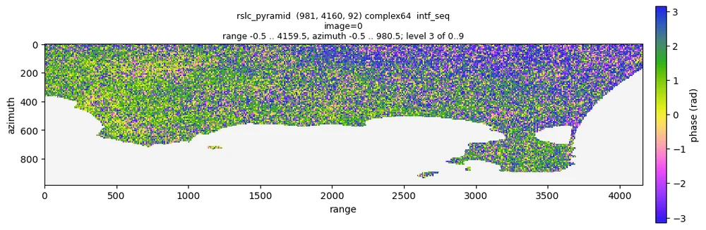
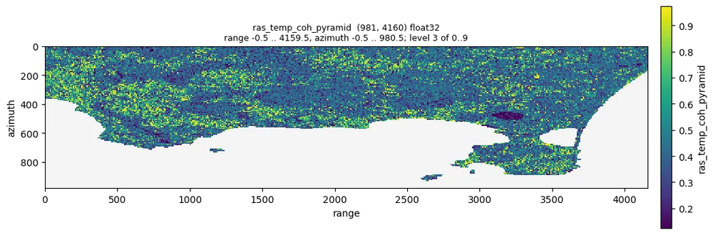
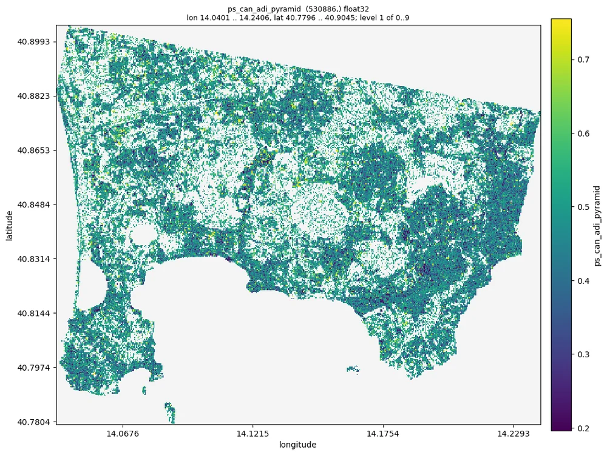
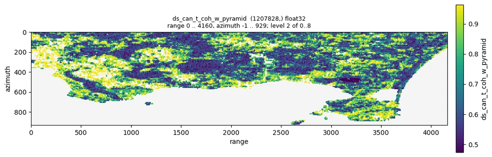
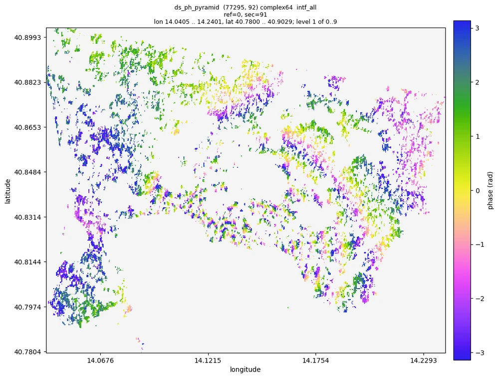
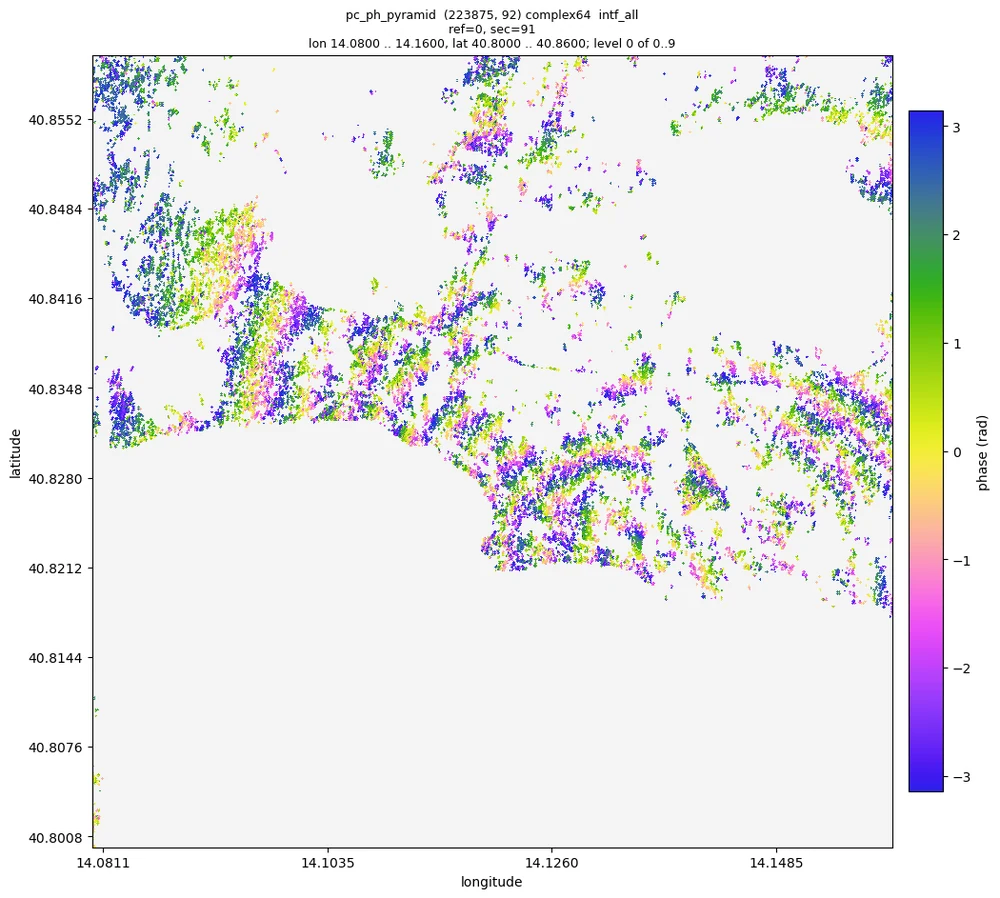
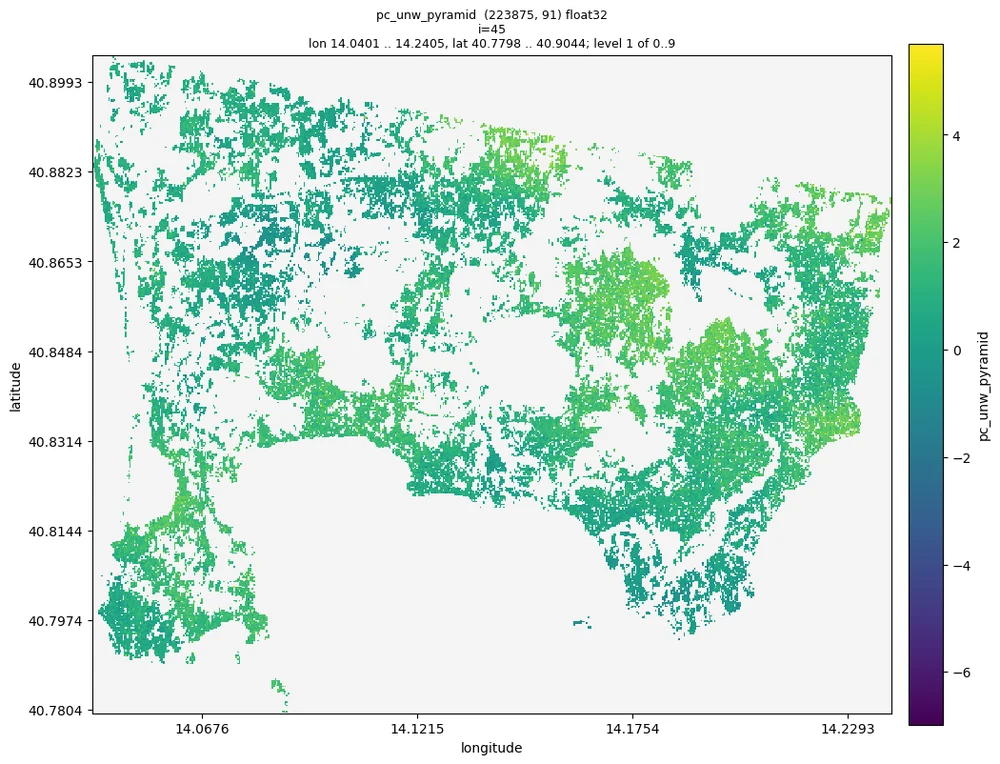

# Talk to an agent

moraine is built so that an AI coding agent can run it for you: the repository carries the instructions
([`AGENTS.md`](../dev/agents.md)), every command explains itself (`--help`, `--json`), the pipelines resume
where they stopped and the results can be checked without a plot script (`moraine info`, `moraine quicklook`).
You describe the data and what you want in plain words; the agent reads the guides, runs the verified
pipelines, compares the results with the expected ranges, looks at the pictures and reports.

!!! info "A recorded session"
    What follows is a condensed transcript of a real session on 2026-10-08: Claude Code in the moraine
    repository on a GPU node (one A100 of the machine, 128 CPU cores), processing the Campi Flegrei data set
    (Sentinel-1 descending track 22, 92 dates from 2019-01-02 to 2021-12-29, 981 x 4160 pixels at full
    resolution, GAMMA results in `data/CampiFlegrei/gamma`). The agent's words are shortened; every command, its
    output, the numbers and the figures are from that run. The five pipelines took 500 s of processing.

<div class="mo-chat mo-transcript" markdown>

<div class="mo-msg mo-msg--user" markdown>
<div class="mo-avatar">you</div>
<div class="mo-bubble" markdown>
Process the GAMMA data in `data/CampiFlegrei/gamma` (reference 20200707) up to phase unwrapping, working
directory `manual_demo/campi`. Tell me what you see.
</div>
</div>

<div class="mo-msg mo-msg--agent" markdown>
<div class="mo-avatar">AI</div>
<div class="mo-bubble" markdown>
I read `AGENTS.md`, the guide of the first workflow (`docs/workflows/01_load.md`) and the description of the data
set (`data/CampiFlegrei/README.md`): 92 dates, reference 20200707, the geocoding files are prefixed 20200707, and
GAMMA is on the PATH (`which base_calc`). I use one GPU (`CUDA_VISIBLE_DEVICES=1`) and the verified pipelines of
`examples/`, in order.

**1. Load the GAMMA results**

```console
$ moraine run examples/01_load.toml --workdir manual_demo/campi \
      --var gamma=data/CampiFlegrei/gamma --var reference=20200707 --var geo=20200707
[rslc] load-gamma-flatten-rslc ... done in 125.8 s
[lat_lon_hgt] load-gamma-lat-lon-hgt ... done in 6.9 s
[look_vector] load-gamma-look-vector ... done in 3.8 s
[range] load-gamma-range ... done in 0.1 s
[metadata] load-gamma-metadata ... done in 1.8 s
[web_mercator] transform ... done in 2.5 s
[rslc_pyramid] ras-pyramid ... done in 20.9 s
$ moraine info raw/rslc.zarr raw/rslc_pyramid
  raw/rslc.zarr: complex64 (981, 4160, 92) chunks (1000, 1000, 1)
  raw/rslc_pyramid: complex64 (981, 4160, 92) raster pyramid, 10 levels
    stats_level=3, nan_fraction=0.404627, amplitude_min=0.000157993, amplitude_max=25.4198,
    amplitude_mean=0.363668, amplitude_std=0.345799, amplitude_p01=0.0229478, amplitude_p50=0.288358, amplitude_p99=1.56296
$ moraine quicklook raw/rslc_pyramid --show intf_seq --index 0 -o 01_intf_seq_0.png
```

The stack has the 92 dates (`raw/meta.toml` lists them, 12 days apart), the amplitude is in the expected range
(p50 0.29) and 40 % of the pixels are nan: the Gulf of Pozzuoli, masked by the coregistration, as the data set
description says. The first 12 day interferogram is noisy single look phase with structure on land and nothing
suspicious (uniform noise would mean a wrong reference date):


</div>
</div>

<div class="mo-msg mo-msg--agent" markdown>
<div class="mo-avatar">AI</div>
<div class="mo-bubble" markdown>
**2. PS candidates.** The guide says to set `shape` to the (nlines, width) of the stack: 981, 4160.

```console
$ moraine run examples/02_ps.toml --workdir manual_demo/campi --var shape=981,4160
[adi] amp-disp ... done in 11.4 s
[n2f] n2f ... done in 32.3 s
[n2f_temp_coh] temp-coh ... done in 11.7 s
[ps_can] pc-union ... done in 0.3 s
[ps_can_data] ras2pc ... done in 6.0 s
(13 steps, 64 s)
$ moraine info ps/ras_adi_pyramid ps/ras_temp_coh_pyramid ps/ps_can_1_gix.zarr ps/ps_can_2_gix.zarr ps/ps_can_hix.zarr
  ps/ras_adi_pyramid: ... p01=0.255305, p50=0.541975, p99=0.786118
  ps/ras_temp_coh_pyramid: ... p01=0.124025, p50=0.428027, p99=0.973471, max=0.999438
  ps/ps_can_1_gix.zarr: int32 (148706, 2)
  ps/ps_can_2_gix.zarr: int32 (530416, 2)
  ps/ps_can_hix.zarr: int64 (530886,)
```

Against the guide: amplitude dispersion p50 0.54 (sane 0.3 to 1), temporal coherence within 0 and 1, no warnings.
148 706 candidates have an amplitude dispersion below 0.4 and 530 416 a Noise2Fringe temporal coherence above
0.58; the union is 530 886 points, 22 % of the land pixels (the guide expects a few percent to about 30 %). The
coherence is high on the built-up areas and low on the crater lakes, and the candidates cover Pozzuoli, Bacoli
and the western suburbs of Naples, not the craters and slopes:

<div class="mo-figure-row" markdown>


</div>
</div>
</div>

<div class="mo-msg mo-msg--agent" markdown>
<div class="mo-avatar">AI</div>
<div class="mo-bubble" markdown>
**3. DS.** The Campi Flegrei tutorial uses the window and thresholds of the example (11 x 11 window, `alpha`
0.05, at least 50 SHPs, weighted temporal coherence 0.9), so I run it as it is.

```console
$ moraine run examples/03_ds.toml --workdir manual_demo/campi --var shape=981,4160
[shp_test] shp-test ... done in 25.8 s
[select_shp] select-shp ... done in 13.2 s
[phase_linking] emperical-co-emi-temp-coh-pc ... done in 95.7 s
[ds_ph_pyramid] pc-pyramid ... done in 9.4 s
(17 steps, 162 s)
$ moraine info ds/ras_shp_num_pyramid ds/ds_can_t_coh_w_pyramid ds/ds_can_n_components_pyramid \
      ds/ds_can_hix.zarr ds/ds_connected_hix.zarr ds/ds_hix.zarr
  ds/ras_shp_num_pyramid: ... min=0.0, max=121.0, p50=20.0, p99=110.0
  ds/ds_can_t_coh_w_pyramid: ... p01=0.473767, p50=0.62943, p99=0.963676
  ds/ds_can_n_components_pyramid: ... min=1.0, max=84.0, p50=5.0
  ds/ds_can_hix.zarr: int64 (1207828,)
  ds/ds_connected_hix.zarr: int64 (216506,)
  ds/ds_hix.zarr: int64 (77295,)
```

1 207 828 pixels have at least 50 SHPs; 216 506 of them (17.9 %) have all 92 images connected by coherent image
pairs, and 77 295 of those reach a weighted temporal coherence of 0.9: the DS. That is 6.4 % of the candidates,
fewer than on the sample data of the guide (12 %): the median number of SHPs is 20 against 107 there, because at
the full Sentinel-1 resolution an 11 x 11 window covers only 26 m across track, and with 92 images most coherence
matrices are regularized. The guide names `t_coh_w_min` as the first knob (`--var t_coh_w_min=0.85` keeps more
points); I keep the default and report it. The weighted temporal coherence is high on the homogeneous slopes and
fields, and the phase linked 2019 to 2021 interferogram of the DS is spatially consistent, with the fringes of
the uplift around Pozzuoli:

<div class="mo-figure-row" markdown>


</div>
</div>
</div>

<div class="mo-msg mo-msg--agent" markdown>
<div class="mo-avatar">AI</div>
<div class="mo-bubble" markdown>
**4. Merge and refine**

```console
$ moraine run examples/04_refine.toml --workdir manual_demo/campi
[merge] pc-union ... done in 8.4 s
[n2ft] n2ft ... done in 63.4 s
[temp_coh] temp-coh ... done in 6.6 s
[pc_ph_pyramid] pc-pyramid ... done in 11.0 s
(9 steps, 95 s)
$ moraine info pc/pc_can_hix.zarr pc/pc_can_temp_coh_pyramid pc/pc_hix.zarr
  pc/pc_can_hix.zarr: int64 (590677,)
  pc/pc_can_temp_coh_pyramid: ... p01=0.145293, p50=0.689645, p99=0.99046
  pc/pc_hix.zarr: int64 (223875,)
$ moraine quicklook pc/pc_ph_pyramid --show intf_all --index 0 91 -o 04_pc_intf_0_91.png
$ moraine quicklook pc/pc_ph_pyramid --show intf_all --index 0 91 --extent 14.08,40.80,14.16,40.86 -o zoom.png
```

PS candidates and DS merge into 590 677 points; after the Noise2Fringe Transformer 223 875 (38 %) have a temporal
coherence above 0.8. Their interferogram between the first and the last image shows the concentric fringes of
the caldera uplift centred on Pozzuoli, about ten fringes over three years, continuous across the town; zoomed in
(level 0, single points) the fringes are still there in the dense parts:



</div>
</div>

<div class="mo-msg mo-msg--agent" markdown>
<div class="mo-avatar">AI</div>
<div class="mo-bubble" markdown>
**5. Unwrapping.** The guide asks for the pixel spacings of the data; from `gamma/rslc/20200707.rslc.par`:
2.329562 m in range and 13.9516 m in azimuth.

```console
$ moraine run examples/05_unwrap.toml --workdir manual_demo/campi --var shape=981,4160 \
      --var range_pixel_spacing=2.329562 --var azimuth_pixel_spacing=13.9516
[gix] pc-gix ... done in 0.4 s
[pairs_seq] image-pairs ... done in 0.0 s
[unwrap] mcf-pc ... done in 1.0 s
[unw_pyramid] pc-pyramid ... done in 15.8 s
$ moraine info unw/pc_unw.zarr unw/pc_unw_pyramid
  unw/pc_unw.zarr: float32 (223875, 91) chunks (200000, 1)
  unw/pc_unw_pyramid: ... min=-17.2502, max=13.8788, p01=-6.97704, p50=-0.147673, p99=5.69298
```

91 sequential interferograms of 223 875 points unwrapped in one second; the values stay within a few multiples of
2π as the guide expects, and rewrapping the result gives back the input phase (largest difference 5.6e-7 rad over
the first ten interferograms). The unwrapped 12 day interferograms are smooth, without isolated 2π jumps between
neighbouring areas:



```console
$ moraine view unw/pc_unw_pyramid pc/pc_ph_pyramid --dates raw/meta.toml -o view.ipynb
saved view.ipynb: open it in Jupyter or VS Code and run all cells
```
</div>
</div>

<div class="mo-msg mo-msg--agent" markdown>
<div class="mo-avatar">AI</div>
<div class="mo-bubble" markdown>
**Done.** All five pipelines ran on the Campi Flegrei stack (92 dates, 981 x 4160 pixels) in 500 s of processing
on one A100; every result is within the ranges of the guides.

| step | result | points |
|---|---|---|
| load | `raw/rslc.zarr` (981, 4160, 92) | |
| PS candidates | `ps/ps_can_hix.zarr` | 530 886 |
| DS | `ds/ds_hix.zarr`, `ds/ds_ph.zarr` | 77 295 of 1 207 828 candidates |
| refined points | `pc/pc_hix.zarr`, `pc/pc_ph.zarr` (223 875, 92) | 223 875 |
| unwrapped | `unw/pc_unw.zarr` (223 875, 91), radians | |

What I see: the uplift of the caldera, centred on Pozzuoli, as about ten fringes between 2019-01-02 and
2021-12-29 in the phase linked and filtered points, and smooth unwrapped 12 day interferograms. Two things to
decide: the DS selection kept 6.4 % of the candidates (`t_coh_w_min` 0.9); lowering it to 0.85 keeps more points on
the slopes. And the unwrapped phases have no spatial reference yet: compare points relative to each other, or
choose a reference point in `view.ipynb` (double click) before you read displacements.
</div>
</div>

</div>

## How it works

- **`AGENTS.md`** is the entry point for every agent (Claude Code, Codex, Cursor, ...): the environment, how to
  run and resume the pipelines, how to check results, the data conventions and the rules (never write into the
  sample data, one GPU pipeline at a time, do not delete results). Tool specific files only point to it
  (decision 0008), and `tests/test_docs.py` keeps it in step with the code.
- **The workflow guides** (`docs/workflows/`) give the agent what a colleague would: the parameters, the expected
  ranges of every result on the sample data, what to look at and what to do when the numbers are off. The
  example pipelines are verified on real data before they change (decision 0009).
- **Commands that explain themselves.** `moraine list`, `moraine COMMAND --help` with shapes, dtypes and
  defaults from the docstrings, unknown arguments rejected with a suggestion, `--json` with one object on stdout
  and the summaries of every output.
- **Checks without plots.** `moraine info` gives statistics and anomaly warnings from the pyramids, `moraine
  quicklook` a PNG the agent can look at and zoom into, `moraine view` a notebook for you.
- **Pipelines that resume.** A failing step prints its error and log; the agent fixes the cause and runs the
  file again. A changed parameter reruns only what depends on it.

## Try it

1. [Install moraine](../start/install.md) (and GAMMA if your data are GAMMA results) on the machine with the data
   and, ideally, a GPU.
2. Clone the repository, or copy `AGENTS.md`, `docs/workflows/` and `examples/` next to your data: that is all
   the agent needs besides the `moraine` command.
3. Start your agent in that directory and ask, for example:

    > process the GAMMA data in `/data/site_a` (reference 20220620, geocoding files 20210802) up to unwrapping
    > in `/work/site_a`; use one GPU and tell me what you see

4. Read what it reports, look at the quicklooks and the `view.ipynb` notebook, and ask for changes in words:
   "keep more DS", "unwrap a redundant network with EMCF instead", "mask the sea".

The agent does nothing that you could not do yourself with the [workflows](../workflows/index.md) and the
[command line](../cli/index.md); it reads the same pages.
