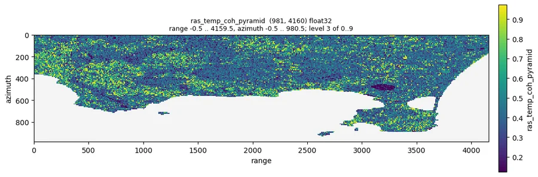
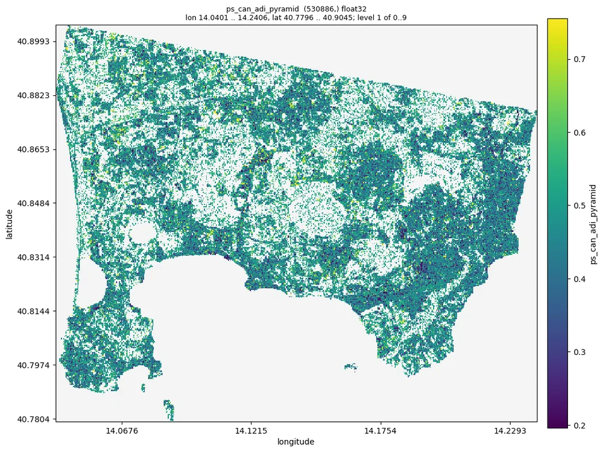
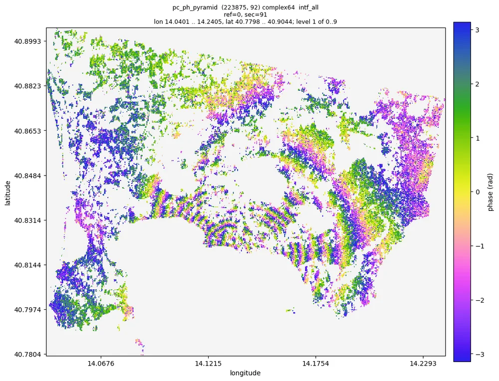
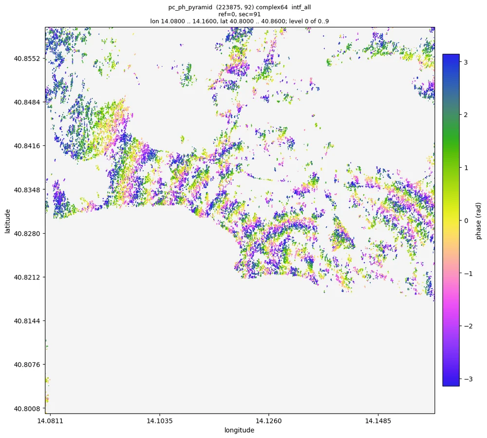
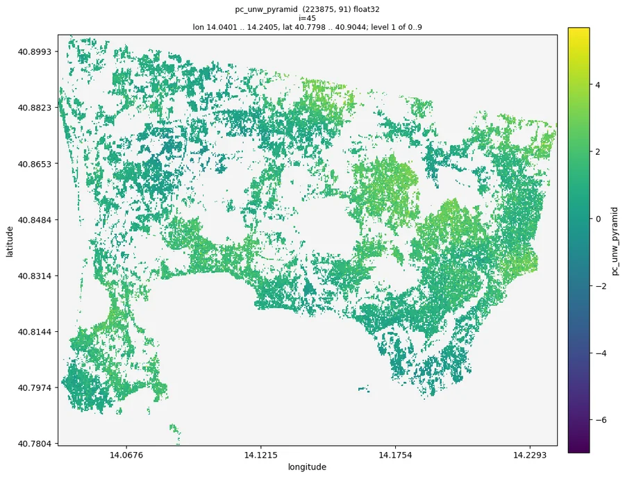

# 与 AI 对话

moraine 的设计目标之一是让 AI 编程 agent 替你运行它：仓库里带着说明（[`AGENTS.md`](../dev/agents.md)），每条命令
都能自我解释（`--help`、`--json`），pipeline 从中断处续跑，结果不用写绘图脚本就能检查（`moraine info`、
`moraine quicklook`）。你用自然语言说明数据和目标；agent 读指南、运行经过验证的 pipeline、把结果和预期范围比对、
看图、汇报。

!!! info "一次真实会话的记录"
    下面是 2026-10-08 一次真实会话的精简记录：Claude Code 在 moraine 仓库里、在一个 GPU 节点上（用了机器上的一块
    A100，128 个 CPU 核）处理 Campi Flegrei 数据集（Sentinel-1 降轨 track 22，2019-01-02 到 2021-12-29 共 92 景，
    全分辨率 981 x 4160 像元，GAMMA 结果在 `data/CampiFlegrei/gamma`）。会话原文是英文，这里是译文，agent 的话有
    删节；每条命令、它的输出、数字和图都来自那次运行。五条 pipeline 的计算共 500 秒。

<div class="mo-chat mo-transcript" markdown>

<div class="mo-msg mo-msg--user" markdown>
<div class="mo-avatar">你</div>
<div class="mo-bubble" markdown>
把 `data/CampiFlegrei/gamma` 里的 GAMMA 数据（参考影像 20200707）处理到相位解缠，工作目录 `manual_demo/campi`。
告诉我你看到了什么。
</div>
</div>

<div class="mo-msg mo-msg--agent" markdown>
<div class="mo-avatar">AI</div>
<div class="mo-bubble" markdown>
我读了 `AGENTS.md`、第一个工作流的指南（`docs/workflows/01_load.md`）和数据集说明（`data/CampiFlegrei/README.md`）：
92 景，参考影像 20200707，地理编码文件前缀 20200707，GAMMA 在 PATH 上（`which base_calc`）。我用一块 GPU
（`CUDA_VISIBLE_DEVICES=1`）和 `examples/` 里经过验证的 pipeline，按顺序运行。

**1. 载入 GAMMA 结果**

```console
$ moraine run examples/01_load.toml --workdir manual_demo/campi \
      --var gamma=data/CampiFlegrei/gamma --var reference=20200707 --var geo=20200707
[rslc] load-gamma-flatten-rslc ... done in 125.8 s
[lat_lon_hgt] load-gamma-lat-lon-hgt ... done in 6.9 s
[look_vector] load-gamma-look-vector ... done in 3.8 s
[range] load-gamma-range ... done in 0.1 s
[metadata] load-gamma-metadata ... done in 1.8 s
[web_mercator] transform ... done in 2.5 s
[rslc_pyramid] ras-pyramid ... done in 20.9 s
$ moraine info raw/rslc.zarr raw/rslc_pyramid
  raw/rslc.zarr: complex64 (981, 4160, 92) chunks (1000, 1000, 1)
  raw/rslc_pyramid: complex64 (981, 4160, 92) raster pyramid, 10 levels
    stats_level=3, nan_fraction=0.404627, amplitude_min=0.000157993, amplitude_max=25.4198,
    amplitude_mean=0.363668, amplitude_std=0.345799, amplitude_p01=0.0229478, amplitude_p50=0.288358, amplitude_p99=1.56296
$ moraine quicklook raw/rslc_pyramid --show intf_seq --index 0 -o 01_intf_seq_0.png
```

堆栈有 92 景（`raw/meta.toml` 列出了日期，间隔 12 天），幅度在预期范围内（p50 0.29），40 % 的像元是 nan：那是
配准时被掩掉的 Pozzuoli 海湾，和数据集说明一致。第一幅 12 天干涉图是带噪声的单视相位，陆地上有结构，没有可疑之处
（如果到处都是均匀噪声，说明参考影像日期错了）：


</div>
</div>

<div class="mo-msg mo-msg--agent" markdown>
<div class="mo-avatar">AI</div>
<div class="mo-bubble" markdown>
**2. PS 候选点。** 指南要求把 `shape` 设为堆栈的 (nlines, width)：981, 4160。

```console
$ moraine run examples/02_ps.toml --workdir manual_demo/campi --var shape=981,4160
[adi] amp-disp ... done in 11.4 s
[n2f] n2f ... done in 32.3 s
[n2f_temp_coh] temp-coh ... done in 11.7 s
[ps_can] pc-union ... done in 0.3 s
[ps_can_data] ras2pc ... done in 6.0 s
(13 steps, 64 s)
$ moraine info ps/ras_adi_pyramid ps/ras_temp_coh_pyramid ps/ps_can_1_gix.zarr ps/ps_can_2_gix.zarr ps/ps_can_hix.zarr
  ps/ras_adi_pyramid: ... p01=0.255305, p50=0.541975, p99=0.786118
  ps/ras_temp_coh_pyramid: ... p01=0.124025, p50=0.428027, p99=0.973471, max=0.999438
  ps/ps_can_1_gix.zarr: int32 (148706, 2)
  ps/ps_can_2_gix.zarr: int32 (530416, 2)
  ps/ps_can_hix.zarr: int64 (530886,)
```

对照指南：幅度离差指数 p50 0.54（合理范围 0.3 到 1），时间相干性在 0 和 1 之间，没有警告。148 706 个候选点的
幅度离差指数低于 0.4，530 416 个点的 Noise2Fringe 时间相干性高于 0.58；并集 530 886 个点，占陆地像元的 22 %
（指南的预期是百分之几到 30 % 左右）。相干性在建成区高、在火山口湖低；候选点覆盖 Pozzuoli、Bacoli 和那不勒斯
西郊，火山口和山坡上没有：

<div class="mo-figure-row" markdown>


</div>
</div>
</div>

<div class="mo-msg mo-msg--agent" markdown>
<div class="mo-avatar">AI</div>
<div class="mo-bubble" markdown>
**3. DS。** Campi Flegrei 教程用的窗口和阈值与示例相同（7 x 27 窗口、`alpha` 0.05、至少 80 个 SHP、加权时间相干性
0.85），所以我原样运行。

```console
$ moraine run examples/03_ds.toml --workdir manual_demo/campi --var shape=981,4160
[shp_test] shp-test ... done in 9.0 s
[phase_linking] emperical-co-emi-temp-coh-pc ... done in 18.6 s
[ds_ph_pyramid] pc-pyramid ... done in 5.1 s
(16 steps, 42 s)
$ moraine info ds/ras_shp_num_pyramid ds/ds_can_t_coh_w_pyramid ds/ds_can_n_components_pyramid \
      ds/ds_can_hix.zarr ds/ds_connected_hix.zarr ds/ds_hix.zarr
  ds/ras_shp_num_pyramid: ... min=0.0, max=189.0, p50=29.0, p99=170.0
  ds/ds_can_t_coh_w_pyramid: ... p01=0.266186, p50=0.589956, p99=0.959546
  ds/ds_can_n_components_pyramid: ... min=1.0, max=85.0, p50=3.0
  ds/ds_can_hix.zarr: int64 (1123313,)
  ds/ds_connected_hix.zarr: int64 (326851,)
  ds/ds_hix.zarr: int64 (167007,)
```

1 123 313 个像元至少有 80 个 SHP；其中 326 851 个（29.1 %）的 92 景影像都被相干像对连通，这些点里又有 167 007 个
的加权时间相干性达到 0.85：这就是 DS，占候选点的 14.9 %，与指南对这个数据集的预期一致。示例的 7 x 27 窗口在地面上
约 100 m x 60 m：在 Sentinel-1 全分辨率下，11 x 11 的窗口在距离向只覆盖 26 m，对 92 景来说 SHP 太少。指南说
`t_coh_w_min` 是第一个调节项（`--var t_coh_w_min=0.9` 可保留 96 741 个点）；我保留默认值并如实汇报。加权时间相干性在均匀的山坡和田地上高，
相位连接后的 DS 在 2019 到 2021 年间的干涉图空间上是一致的，能看到 Pozzuoli 周围隆升的条纹：

<div class="mo-figure-row" markdown>


</div>
</div>
</div>

<div class="mo-msg mo-msg--agent" markdown>
<div class="mo-avatar">AI</div>
<div class="mo-bubble" markdown>
**4. 合并与精化**

```console
$ moraine run examples/04_refine.toml --workdir manual_demo/campi
[merge] pc-union ... done in 8.4 s
[n2ft] n2ft ... done in 28.1 s
[temp_coh] temp-coh ... done in 6.6 s
[pc_ph_pyramid] pc-pyramid ... done in 11.0 s
(9 steps, 95 s)
$ moraine info pc/pc_can_hix.zarr pc/pc_can_temp_coh_pyramid pc/pc_hix.zarr
  pc/pc_can_hix.zarr: int64 (590677,)
  pc/pc_can_temp_coh_pyramid: ... p01=0.21278, p50=0.792471, p99=0.995184
  pc/pc_hix.zarr: int64 (223875,)
$ moraine quicklook pc/pc_ph_pyramid --show intf_all --index 0 91 -o 04_pc_intf_0_91.png
$ moraine quicklook pc/pc_ph_pyramid --show intf_all --index 0 91 --extent 14.08,40.80,14.16,40.86 -o zoom.png
```

PS 候选点和 DS 合并成 675 687 个点；经过 Noise2Fringe Transformer 之后，330 754 个点（49 %）的时间相干性高于 0.8。
它们首尾两景之间的干涉图显示出以 Pozzuoli 为中心的同心隆升条纹，三年约十个条纹，穿过城镇连续；放大到
最细层级（单个点）后，密集处的条纹依然清楚：




</div>
</div>

<div class="mo-msg mo-msg--agent" markdown>
<div class="mo-avatar">AI</div>
<div class="mo-bubble" markdown>
**5. 解缠。** 指南要求数据的像元间距；从 `gamma/rslc/20200707.rslc.par` 读到：距离向 2.329562 m，方位向 13.9516 m。

```console
$ moraine run examples/05_unwrap.toml --workdir manual_demo/campi --var shape=981,4160 \
      --var range_pixel_spacing=2.329562 --var azimuth_pixel_spacing=13.9516
[gix] pc-gix ... done in 0.4 s
[pairs_seq] image-pairs ... done in 0.0 s
[unwrap] mcf-pc ... done in 1.0 s
[unw_pyramid] pc-pyramid ... done in 15.8 s
$ moraine info unw/pc_unw.zarr unw/pc_unw_pyramid
  unw/pc_unw.zarr: float32 (223875, 91) chunks (200000, 1)
  unw/pc_unw_pyramid: ... min=-17.2502, max=13.8788, p01=-6.97704, p50=-0.147673, p99=5.69298
```

330 754 个点的 91 幅序列干涉图 2 秒解缠完毕；数值如指南所料在 2π 的几倍以内，把结果重新缠绕能还原输入相位
（前十幅干涉图的最大差异 5.6e-7 rad）。解缠后的 12 天干涉图平滑，相邻区域之间没有孤立的 2π 跳变：



```console
$ moraine view unw/pc_unw_pyramid pc/pc_ph_pyramid --dates raw/meta.toml -o view.ipynb
saved view.ipynb: open it in Jupyter or VS Code and run all cells
```
</div>
</div>

<div class="mo-msg mo-msg--agent" markdown>
<div class="mo-avatar">AI</div>
<div class="mo-bubble" markdown>
**完成。** 五条 pipeline 在 Campi Flegrei 堆栈（92 景，981 x 4160 像元）上跑完，一块 A100 上共 500 秒计算；每个
结果都在指南的范围内。

| 步骤 | 结果 | 点数 |
|---|---|---|
| 载入 | `raw/rslc.zarr` (981, 4160, 92) | |
| PS 候选点 | `ps/ps_can_hix.zarr` | 530 886 |
| DS | `ds/ds_hix.zarr`、`ds/ds_ph.zarr` | 1 123 313 个候选点中的 167 007 |
| 精化点 | `pc/pc_hix.zarr`、`pc/pc_ph.zarr` (330 754, 92) | 330 754 |
| 解缠 | `unw/pc_unw.zarr` (330 754, 91)，弧度 | |

我看到的：火山口以 Pozzuoli 为中心的隆升，在相位连接并滤波后的点上表现为 2019-01-02 到 2021-12-29 之间约十个
条纹，以及平滑的 12 天解缠干涉图。有两件事要你决定：DS 筛选只保留了候选点的 14.9 %（`t_coh_w_min` 0.85），降到
0.85 能在山坡上保留更多点；解缠相位还没有空间参考，读形变之前请只做点与点之间的相对比较，或者在 `view.ipynb`
里双击选一个参考点。
</div>
</div>

</div>

## 原理

- **`AGENTS.md`** 是所有 agent（Claude Code、Codex、Cursor 等）的入口：环境、怎样运行和续跑 pipeline、怎样检查结果、
  数据约定和规则（不往样例数据里写、一次只跑一条 GPU pipeline、不删结果）。各工具专用的文件只指向它（决策 0008），
  `tests/test_docs.py` 保证它与代码一致。
- **工作流指南**（`docs/workflows/`）给 agent 的正是一位同事会给的东西：参数、样例数据上每个结果的预期范围、看什么、
  数字不对时怎么办。示例 pipeline 每次改动前都在真实数据上验证（决策 0009、0033）。
- **能自我解释的命令。** `moraine list`，`moraine COMMAND --help` 给出 docstring 里的形状、类型和默认值，未知参数被
  拒绝并给出建议，`--json` 在 stdout 打印一个对象和每个输出的摘要。
- **不用画图的检查。** `moraine info` 从金字塔给出统计量和异常警告，`moraine quicklook` 出一张 agent 能看、能放大的
  PNG，`moraine view` 给你一个 notebook。
- **可续跑的 pipeline。** 失败的步骤打印错误和日志；agent 修好原因后再运行一次文件。改了参数只重跑依赖它的步骤。

## 自己试试

1. 在放数据的机器上[安装 moraine](../start/install.md)（数据是 GAMMA 结果的话还要装 GAMMA），最好有 GPU。
2. 克隆仓库，或把 `AGENTS.md`、`docs/workflows/` 和 `examples/` 复制到数据旁边：除了 `moraine` 命令，agent 只需要这些。
3. 在那个目录里启动你的 agent，比如这样问：

    > 把 `/data/site_a` 的 GAMMA 数据（参考影像 20220620，地理编码文件前缀 20210802）处理到解缠，工作目录
    > `/work/site_a`；用一块 GPU，告诉我你看到了什么

4. 读它的汇报，看 quicklook 和 `view.ipynb`，再用一句话提要求："多留一些 DS"、"改用 EMCF 解缠冗余网络"、"把海掩掉"。

agent 做的事你用[工作流](../workflows/index.md)和[命令行](../cli/index.md)都能自己做；它读的是同样的页面。
