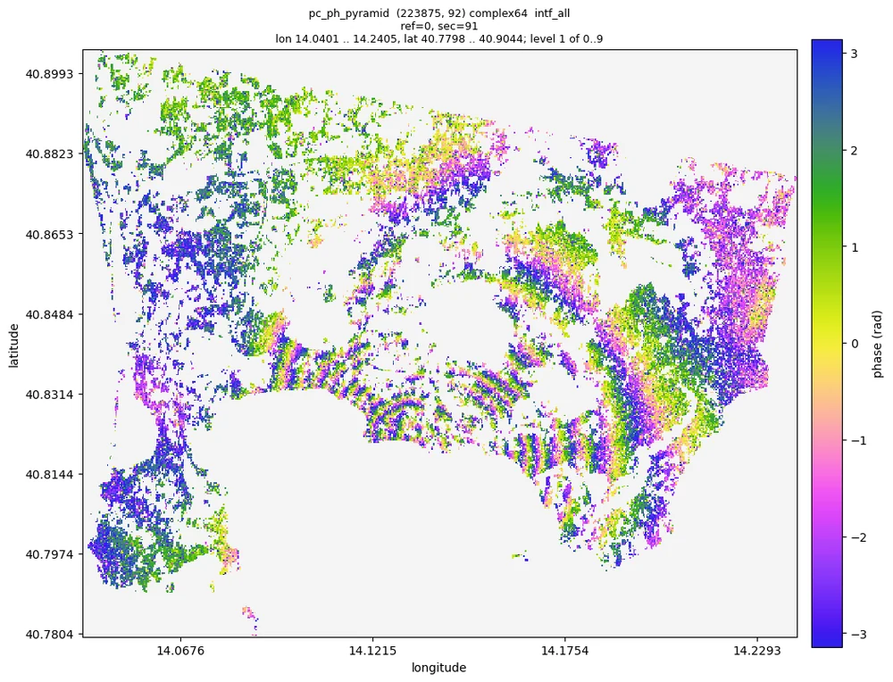
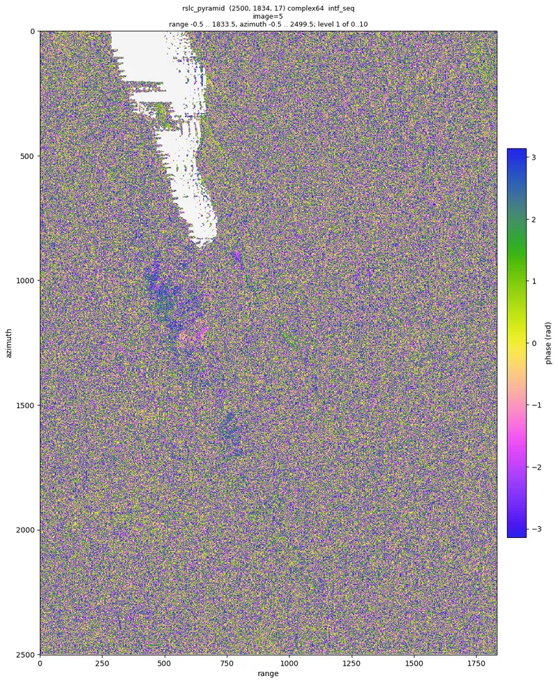
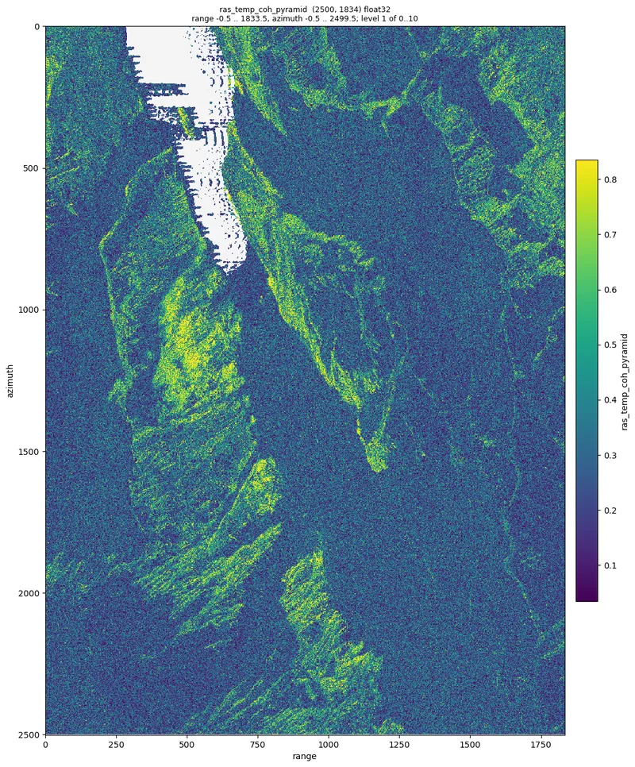
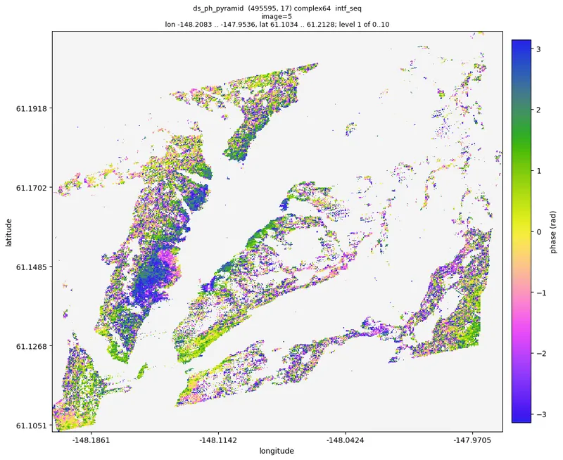
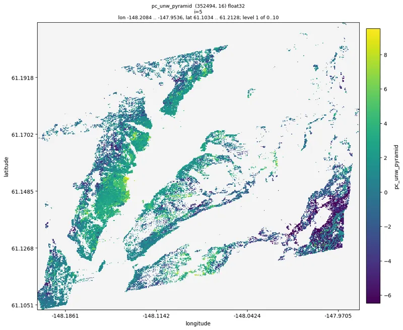

<div class="mo-section" markdown>
<p class="mo-kicker">AI + InSAR</p>
## One sentence to a deformation time series

moraine ships with instructions for coding agents ([`AGENTS.md`](dev/agents.md)) and a command line whose help,
checks and JSON output are made for them. You describe the data and what you want; the agent runs the verified
pipelines, looks at the results and reports. This is the beginning of a real session, recorded on the Campi
Flegrei data set (Sentinel-1, 92 dates); the whole of it is on the [Talk to an agent](agent/index.md) page.

<div class="mo-chat" aria-label="a conversation with a coding agent">
  <div class="mo-msg mo-msg--user"><div class="mo-avatar">you</div><div class="mo-bubble">
    <p>Process the GAMMA data in <code>data/CampiFlegrei/gamma</code> (reference 20200707) up to phase unwrapping,
    working directory <code>manual_demo/campi</code>. Tell me what you see.</p>
  </div></div>
  <div class="mo-msg mo-msg--agent"><div class="mo-avatar">AI</div><div class="mo-bubble">
    <p>I read <code>AGENTS.md</code> and the guide of the first workflow, then start with the load pipeline:</p>
    <div class="mo-term"><b>$</b> moraine run examples/01_load.toml --workdir manual_demo/campi \
    --var gamma=data/CampiFlegrei/gamma --var reference=20200707 --var geo=20200707
<i>rslc</i> load-gamma-flatten-rslc ... done (125.8 s)
<i>rslc_pyramid</i> ras-pyramid ... done (20.9 s)
<span class="mo-ok">pipeline finished: 7 steps, 161.8 s</span></div>
    <p>The stack is (981, 4160, 92) complex64; 40 % of the pixels are nan, which is the Gulf of Pozzuoli masked by the
    coregistration, as the data set description says. Next: PS candidates.</p>
  </div></div>
  <div class="mo-msg mo-msg--agent"><div class="mo-avatar">AI</div><div class="mo-bubble">
    <p>... four pipelines and 500 s of processing later: 223 875 refined points, unwrapped. The interferogram between
    the first and the last image shows the uplift of the caldera as about ten fringes centred on Pozzuoli.</p>
    
    <p><span class="mo-cursor">Two things to decide: the DS threshold and the reference point</span></p>
  </div></div>
</div>
</div>

<div class="mo-section" markdown>
<p class="mo-kicker">The chain</p>
## From GAMMA results to unwrapped phase in five pipelines

Verified on the sample data set (2500 x 1834 pixels, 17 dates) before every change; each one has a guide with the
parameters, the expected ranges and the checks. [Workflows](workflows/index.md)

<div class="mo-chain">
  <figure><figcaption><b>01 load</b> GAMMA results to zarr; a raw 1 x 1 look interferogram</figcaption></figure>
  <figure><figcaption><b>02 PS</b> amplitude dispersion and Noise2Fringe temporal coherence</figcaption></figure>
  <figure><figcaption><b>03 DS</b> SHP, coherence matrices, EMI phase linking, DS selection</figcaption></figure>
  <figure><figcaption><b>04 refine</b> PS + DS, Noise2Fringe Transformer, temporal coherence</figcaption></figure>
  <figure><figcaption><b>05 unwrap</b> minimum cost flow on a Delaunay network</figcaption></figure>
</div>
</div>

<div class="mo-section" markdown>
<p class="mo-kicker">What is inside</p>
## A collection of functions, not a workflow

<div class="mo-grid" markdown>
<div class="mo-card" markdown>
### PS and DS selection
Amplitude dispersion, statistically homogeneous pixels by a Kolmogorov-Smirnov test, DS candidates and their
coherence matrices. [ps](api/ps.md), [shp](api/shp.md), [co](api/co.md)
</div>
<div class="mo-card" markdown>
### Phase linking
EMI with an adaptive regularization for coherence matrices that are not positive definite, the weighted temporal
coherence and the connectivity of the coherent image pairs. [pl](api/pl.md)
</div>
<div class="mo-card" markdown>
### Deep learning filters
Noise2Fringe on rasters and the Noise2Fringe Transformer on point clouds: trained models, PyTorch, no clean data
needed. [dl](api/dl.md)
</div>
<div class="mo-card" markdown>
### Phase unwrapping
Minimum cost flow on a Delaunay network of points, EMCF on any network of image pairs, correction of unwrapping
errors by phase closure. [unwrap](api/unwrap.md)
</div>
<div class="mo-card" markdown>
### Big data
Arrays in memory are numpy or cupy, on disk zarr; the commands process chunks with dask on CPUs or several GPUs,
larger than memory. [Concepts](start/concepts.md)
</div>
<div class="mo-card" markdown>
### Agent ready
Every function is a command with complete help, `--json` output and pipelines that resume where they stopped.
[Command line](cli/index.md), [Pipeline files](contracts/pipeline-file.md)
</div>
</div>
</div>

<div class="mo-section" markdown>
<p class="mo-kicker">Three ways in</p>
## Python, command line or conversation

=== "Python"

    ```python
    import moraine as mr          # arrays in memory (numpy on the CPU, cupy on the GPU)
    import moraine.cli as mc      # zarr in, zarr out, chunk by chunk with dask

    ph = mr.emi(coh)              # phase linking of a block of points
    mc.emi('ds/coh.zarr', 'ds/ph.zarr', cuda=True)   # the same for a whole data set
    ```

=== "Command line"

    ```bash
    moraine list                                    # every processing command
    moraine emi --help                              # arguments with shapes, dtypes and defaults
    moraine run examples/02_ps.toml --workdir WORK  # a verified pipeline; rerun to resume
    moraine info ps/ras_adi_pyramid                 # statistics of a result without loading it
    moraine quicklook ps/ras_adi_pyramid -o adi.png # a picture of the whole scene
    ```

=== "Conversation"

    > process the GAMMA data in `/data/site_a` (reference 20220620) up to unwrapping in `/work/site_a`

    Any coding agent that works in the repository (Claude Code, Codex, Cursor, ...) reads `AGENTS.md` and
    does the rest. See [Talk to an agent](agent/index.md).

Install with `pip install moraine` (CPU) or add cupy, numba-cuda, dask-cuda and rmm with conda for the GPU:
[Install](start/install.md).
</div>
