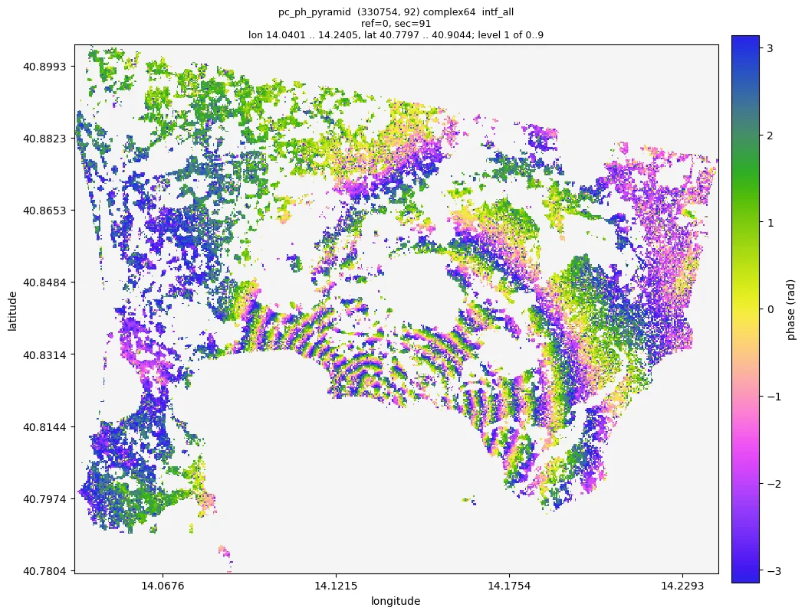
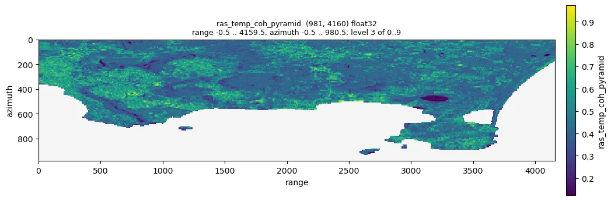
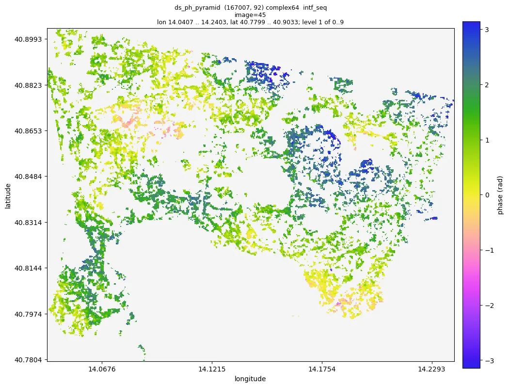
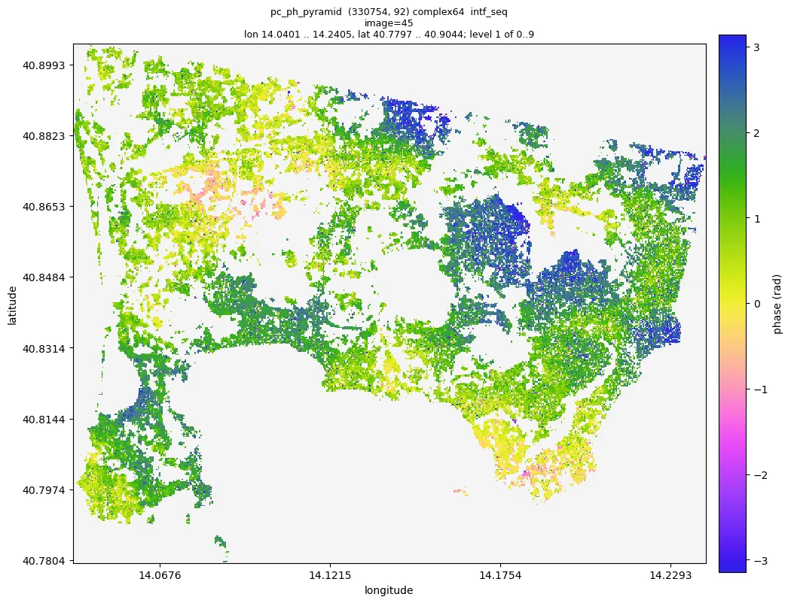
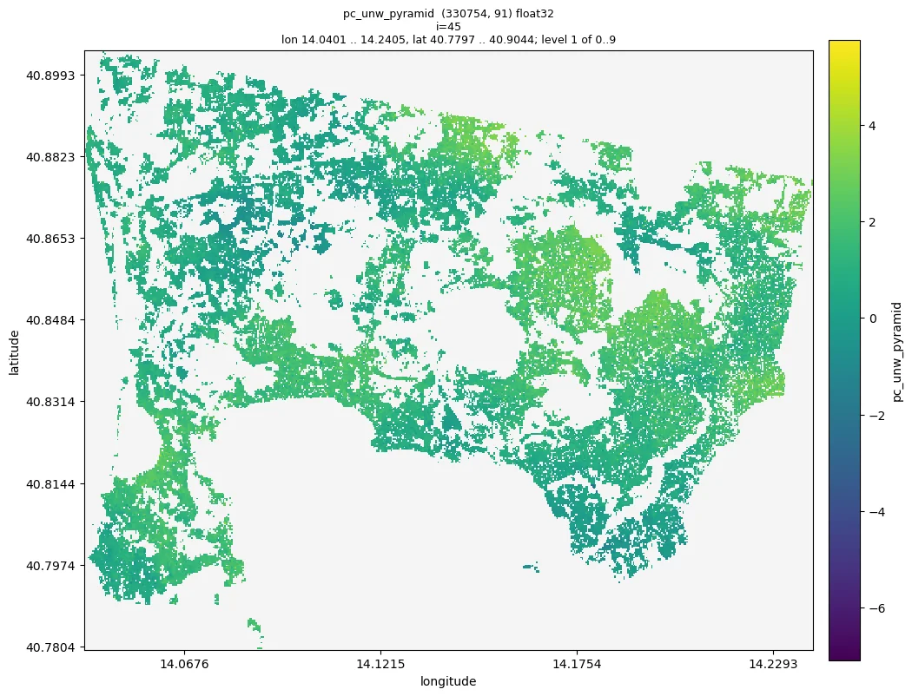

<div class="mo-section" markdown>
<p class="mo-kicker">AI + InSAR</p>
## 一句话，得到形变时间序列

moraine 自带给编程 agent 看的说明（[`AGENTS.md`](dev/agents.md)），命令行的帮助、检查和 JSON 输出都是为它们设计的。
你用自然语言说明数据在哪、要什么；agent 运行经过验证的 pipeline，查看结果，向你汇报。下面是一次真实会话的开头，
数据是 Campi Flegrei（Sentinel-1，92 景）；完整记录在[与 AI 对话](agent/index.md)页。

<div class="mo-chat" aria-label="与编程 agent 的一次对话">
  <div class="mo-msg mo-msg--user"><div class="mo-avatar">你</div><div class="mo-bubble">
    <p>把 <code>data/CampiFlegrei/gamma</code> 里的 GAMMA 数据（参考影像 20200707）处理到相位解缠，工作目录
    <code>manual_demo/campi</code>。告诉我你看到了什么。</p>
  </div></div>
  <div class="mo-msg mo-msg--agent"><div class="mo-avatar">AI</div><div class="mo-bubble">
    <p>我先读 <code>AGENTS.md</code> 和第一个工作流的指南，然后运行载入 pipeline：</p>
    <div class="mo-term"><b>$</b> moraine run examples/01_load.toml --workdir manual_demo/campi \
    --var gamma=data/CampiFlegrei/gamma --var reference=20200707 --var geo=20200707
<i>rslc</i> load-gamma-flatten-rslc ... done (125.8 s)
<i>rslc_pyramid</i> ras-pyramid ... done (20.9 s)
<span class="mo-ok">pipeline finished: 7 steps, 161.8 s</span></div>
    <p>影像堆栈是 (981, 4160, 92) 的 complex64；40 % 的像元是 nan，那是配准时被掩掉的 Pozzuoli 海湾，与数据集说明一致。
    下一步：PS 候选点。</p>
  </div></div>
  <div class="mo-msg mo-msg--agent"><div class="mo-avatar">AI</div><div class="mo-bubble">
    <p>…… 四条 pipeline、500 秒计算之后：223 875 个精化点，已解缠。首尾两景之间的干涉图显示出火山口的隆升，
    约十个条纹，以 Pozzuoli 为中心。</p>
    
    <p><span class="mo-cursor">有两件事需要你决定：DS 阈值和参考点</span></p>
  </div></div>
</div>
</div>

<div class="mo-section" markdown>
<p class="mo-kicker">处理链</p>
## 五条 pipeline：从 GAMMA 结果到解缠相位

每次改动前都在 Campi Flegrei 数据集（Sentinel-1，92 景，981 x 4160 像元）上完整跑过；每条 pipeline 都有一份指南，
写明参数、预期结果和检查方法。图来自那次运行。[工作流](workflows/index.md)

<div class="mo-chain">
  <figure><figcaption><b>01 载入</b> GAMMA 结果转为 zarr；一幅 1 x 1 视的原始干涉图</figcaption></figure>
  <figure><figcaption><b>02 PS</b> 幅度离差指数与 Noise2Fringe 时间相干性</figcaption></figure>
  <figure><figcaption><b>03 DS</b> SHP、相干矩阵、EMI 相位连接、DS 筛选</figcaption></figure>
  <figure><figcaption><b>04 精化</b> PS + DS，Noise2Fringe Transformer，时间相干性</figcaption></figure>
  <figure><figcaption><b>05 解缠</b> Delaunay 网络上的最小费用流</figcaption></figure>
</div>
</div>

<div class="mo-section" markdown>
<p class="mo-kicker">里面有什么</p>
## 一组函数，而不是一条固定的工作流

<div class="mo-grid" markdown>
<div class="mo-card" markdown>
### PS 与 DS 筛选
幅度离差指数、Kolmogorov-Smirnov 检验选出的统计同质像元（SHP）、DS 候选点及其相干矩阵。[ps](api/ps.md)、[shp](api/shp.md)、[co](api/co.md)
</div>
<div class="mo-card" markdown>
### 相位连接
EMI，对非正定的相干矩阵做自适应正则化；加权时间相干性和相干像对的连通性。[pl](api/pl.md)
</div>
<div class="mo-card" markdown>
### 深度学习滤波
栅格上的 Noise2Fringe 和点云上的 Noise2Fringe Transformer：训练好的模型，PyTorch，不需要干净样本。[dl](api/dl.md)
</div>
<div class="mo-card" markdown>
### 相位解缠
点的 Delaunay 网络上的最小费用流、任意像对网络上的 EMCF、按相位闭合校正解缠误差。[unwrap](api/unwrap.md)
</div>
<div class="mo-card" markdown>
### 大数据
内存中是 numpy 或 cupy 数组，磁盘上是 zarr；命令用自己的 worker 分块处理，CPU 或多块 GPU，数据可以大于内存。[概念](start/concepts.md)
</div>
<div class="mo-card" markdown>
### 为 agent 而生
每个函数都是一条命令，帮助完整，有 `--json` 输出，pipeline 从中断处续跑。[命令行](cli/index.md)、[Pipeline 文件](contracts/pipeline-file.md)
</div>
</div>
</div>

<div class="mo-section" markdown>
<p class="mo-kicker">三种用法</p>
## Python、命令行或对话

=== "Python"

    ```python
    import moraine as mr          # 内存中的数组（CPU 上 numpy，GPU 上 cupy）
    import moraine.cli as mc      # zarr 进、zarr 出，分块处理

    ph = mr.emi(coh)              # 一块点的相位连接
    mc.emi('ds/coh.zarr', 'ds/ph.zarr', cuda=True)   # 整个数据集
    ```

=== "命令行"

    ```bash
    moraine list                                    # 所有处理命令
    moraine emi --help                              # 参数的形状、类型和默认值
    moraine run examples/02_ps.toml --workdir WORK  # 经过验证的 pipeline；再运行一次即续跑
    moraine info ps/ras_adi_pyramid                 # 不加载数据就得到结果的统计量
    moraine quicklook ps/ras_adi_pyramid -o adi.png # 整幅场景的图
    ```

=== "对话"

    > 把 `/data/site_a` 的 GAMMA 数据（参考影像 20220620）处理到解缠，工作目录 `/work/site_a`

    任何在仓库里工作的编程 agent（Claude Code、Codex、Cursor 等）读 `AGENTS.md` 后就能完成其余的事。见[与 AI 对话](agent/index.md)。

安装：`pip install moraine`（CPU），GPU 另用 conda 装 cupy 和 numba-cuda：[安装](start/install.md)。
</div>
