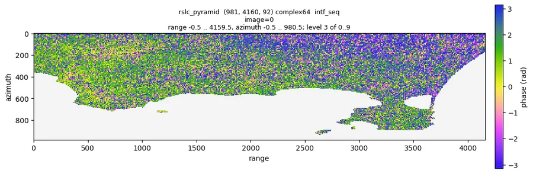

# 01 Load GAMMA results

Pipeline: `examples/01_load.toml`. Tutorial: `nbs/Tutorials/CLI/CampiFlegrei/01_load.ipynb`.

## Input

A GAMMA processing directory with co-registered SLCs and geocoding products:

```
gamma/
├── rslc/       YYYYMMDD.rslc, YYYYMMDD.rslc.par   (co-registered SLCs, one per date)
├── geocoding/  <geo>.hgt, <geo>.diff_par, <geo>.lt_fine, <geo>.lv_theta, <geo>.lv_phi
└── DEM/        dem_seg_par
```

Ask the user for the directory, the reference date (`reference`, the date the rslc stack is flattened to)
and the date prefix of the geocoding files (`geo`) if they are not obvious from the file names. The defaults
of the file are the ones of the sample data set, Campi Flegrei (`data/CampiFlegrei/gamma`, decision 0033).

```bash
moraine run examples/01_load.toml --workdir WORK --var gamma=/path/to/gamma --var reference=20200707 --var geo=20200707
```

GAMMA must be on PATH (`which base_calc phase_sim_orb geocode create_offset`).

## Steps and outputs (WORK/raw/)

| step | command | output |
|---|---|---|
| rslc | load-gamma-flatten-rslc | `rslc.zarr` (nlines, width, nimages) complex64, flat earth and topography removed |
| lat_lon_hgt | load-gamma-lat-lon-hgt | `lat.zarr`, `lon.zarr` float64, `hgt.zarr` float32, (nlines, width); nan where 0 in GAMMA |
| look_vector | load-gamma-look-vector | `theta.zarr`, `phi.zarr` (elevation / orientation angle) |
| range | load-gamma-range | `range.zarr` slant range distance |
| metadata | load-gamma-metadata | `meta.toml` (dates, wavelength, heading, pixel spacing, perpendicular baselines) |
| web_mercator | transform | `e.zarr`, `n.zarr` web mercator coordinates (EPSG:3857) for map plots |
| rslc_pyramid | ras-pyramid | `rslc_pyramid/` to check the interferograms |

Sample data (Campi Flegrei, 981 x 4160 x 92, 2026-10-08): 162 s, 126 s of it `phase_sim_orb` for each date
(64 threads); the pyramid takes 21 s.

## Expected results (sample data)

| result | sample value | sane range |
|---|---|---|
| `rslc.zarr` | complex64 (981, 4160, 92), chunks (1000, 1000, 1) | the number of dates in `rslc/` |
| `rslc_pyramid` amplitude | p01 0.023, p50 0.29, p99 1.56 | p50 roughly 0.1-1 |
| `rslc_pyramid` nan_fraction | 0.40 (the Gulf of Pozzuoli, zero in the coregistered SLCs) | small, unless water or the footprint is masked |
| `meta.toml` dates | 92, 12 days apart | all dates of `rslc/`, in order |

## Figures

Quicklooks of the sample data run of 2026-10-08:



*Sequential interferogram 0 of the raw stack (`quicklook raw/rslc_pyramid --show intf_seq --index 0`): noisy single
look phase with structure on land, nan on the gulf.*

## Checks

- `moraine info raw/rslc.zarr`: shape (nlines, width, number of dates in `rslc/`).
- `moraine info raw/rslc_pyramid`: amplitude p50 around 0.1-1. A nan_fraction near 1 means the GAMMA files did
  not match; on the sample data 0.40 is the sea.
- `moraine quicklook raw/rslc_pyramid --show intf_seq --index I -o intf.png`: sequential
  interferograms. Expect noisy phase with visible fringes / structure in coherent areas; pure uniform
  noise everywhere suggests a wrong reference date or unflattened data.
- `raw/meta.toml`: `dates` must list all dates in order.

## Problems

- `sh: base_calc: command not found`: GAMMA is not on PATH.
- A step fails on a missing `*.par` / geocoding file: check `geo` / `reference`.
- The scratch directory (`raw/scratch`) keeps GAMMA intermediates; it can be deleted after the run.
