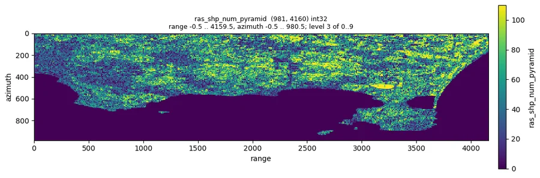
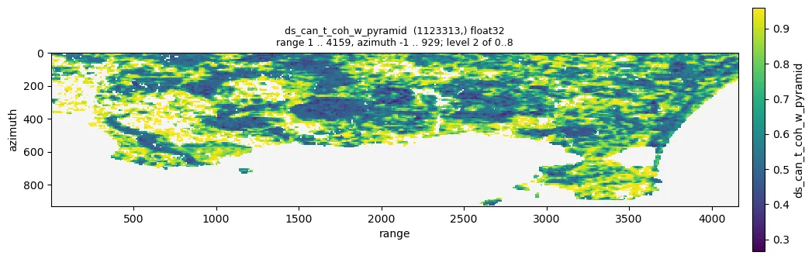
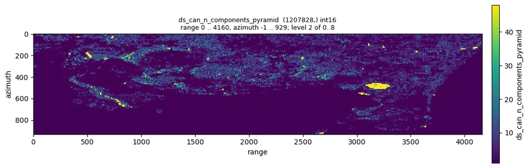
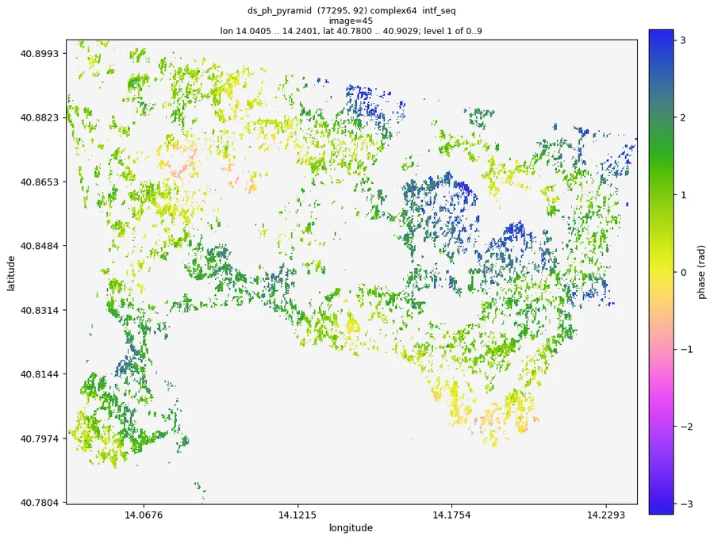
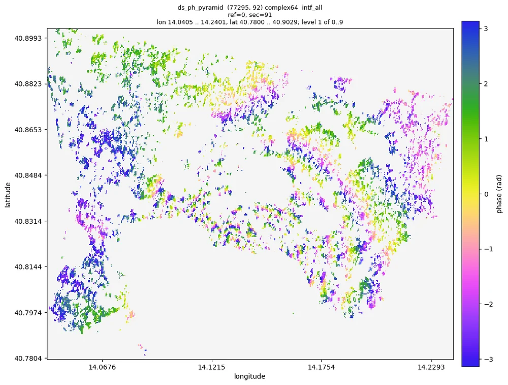

# 03 DS processing

Pipeline: `examples/03_ds.toml`. Tutorial: `nbs/Tutorials/CLI/CampiFlegrei/03_ds.ipynb`. Needs `01_load`.

```bash
moraine run examples/03_ds.toml --workdir WORK
```

Set `[vars] shape` to the (nlines, width) of `raw/rslc.zarr` (`--var shape=NLINES,WIDTH`; the default is the
sample data set) and `[defaults] cuda = false` without a GPU.

The phase linking on the GPU slows down with the number of images faster than on the CPU (A100 vs 128 cores, per DS
candidate: 4.7 vs 11 us for 92 images, 13 vs 24 us for 128, 26 vs 26 us for 150, 48 vs 54 us for 196; decision
0031): from about 150 images on, `cuda = false` is about as fast on a machine with many cores.

## Steps

1. **SHP**: `shp-test` runs a two sample Kolmogorov-Smirnov test between each pixel and the pixels in its
   window (11 x 11 with `az_half_win = r_half_win = 5`) and keeps the pixels whose p value is at least
   `alpha` (0.05: the test does not reject that they have the same distribution as the centre pixel) as
   SHPs (`ras_is_shp.zarr`), counted in `ras_shp_num.zarr` (0..121). The p values are not kept; add
   `pvalue = "ds/ras_pvalue.zarr"` to the step to save them (2 GB for the sample data) and select the SHPs
   again at another level with `select-shp`.
2. **DS candidates**: pixels with at least 50 SHPs (`pc-logic-ras`, `ras>=50`).
3. **Coherence + phase linking + temporal coherence per raster chunk**: `ras2pc-ras-chunk` splits the
   SHPs of the candidates by raster chunk; `emperical-co-emi-temp-coh-pc` estimates the coherence
   matrix, runs EMI phase linking and computes the DS temporal coherence, the weighted temporal
   coherence (`t_coh_w_dir`) and the number of connected components of the coherent image pairs
   (`n_components_dir`) without storing the full coherence matrices. EMI regularizes coherence matrices whose magnitude is not positive definite
   (`regularize`, default true; decisions 0023, 0026). (`emperical-co-pc` + `emi` + `ds-temp-coh` do the
   same in separate steps and keep the coherence.)
4. **Hilbert order**: `pc-hix`, `pc-sort` (writes the sorted gix and the sorting key), `pc-concat` merges
   the per-chunk results with both keys.
5. **Selection**: `n_components == 1` (`pc-logic-pc`), the weighted temporal coherence of those points
   (`pc-select-data`) in [`t_coh_w_min`, 1.0] (`pc-logic-pc`), then `pc-select-data` and `ras2pc` for
   e/n. `pc-logic-pc` takes one input, hence the two steps.

Outputs (WORK/ds/): all candidates `ds_can_{hix,gix,ph,t_coh,t_coh_w,n_components}.zarr` (`t_coh` is
the plain temporal coherence, not used for the selection); refined DS
`ds_hix.zarr`, `ds_ph.zarr` (n_points, nimages) unit amplitude, `ds_gix.zarr`, `ds_e.zarr`, `ds_n.zarr`;
per-chunk data in `ds/chunks/` (can be deleted afterwards).

## Parameters

- Window: larger windows find more SHPs but blur details; 11 x 11 is common, 7 x 7 for small features. Mind the
  pixel shape: at the full Sentinel-1 resolution of the sample data (2.3 m in range, 14 m in azimuth) an 11 x 11
  window covers 26 m x 153 m on the ground; the example uses 7 x 27 (see below), 46 % of the land pixels then have at
  least 80 SHPs.
- `alpha` of `shp-test`: 0.05; a larger value keeps fewer SHPs. With few images (tens) the test separates
  pixels of different brightness poorly (15 images, alpha 0.05: a pixel 3 times brighter in intensity passes as
  SHP in about half of the cases, while 2.6 % of truly homogeneous pixels are rejected). Raising it does not
  pay: on the sample data alpha 0.2 selects 183 000 instead of 496 000 DS and fewer of them pass the n2ft
  refinement of 04 (82 % instead of 88 %). Minimum SHP number: 50 of 121 here; scale it with the window size.
- Window and number of images: the coherence matrix has as many rows as images and is estimated from the SHPs,
  so long stacks need more SHPs than the 11 x 11 window gives. Campi Flegrei (92 images, Sentinel-1 at full
  resolution, 2.3 x 14 m pixels): `az_half_win = 3`, `r_half_win = 13` (7 x 27 pixels, about 100 m x 60 m on
  the ground) with at least 80 SHPs links all images at 29 % instead of 18 % of the candidates and doubles the
  DS at the same quality. A window of 33 pixels (`az_half_win = 1`, `r_half_win = 5`) gives too few looks there.
- Selection (decisions 0024, 0027, 0028): a point is a DS when all its images are linked to each other by
  coherent image pairs (`n_components == 1`) and its weighted temporal coherence is at least `t_coh_w_min`
  (0.85). The weighted temporal coherence only checks the pairs that are coherent; if they do not link all
  images, the phase between the groups of images is not constrained by any pair, whatever its value is.
  An image pair is coherent when its squared coherence is above the noise level that a point without any
  coherent pair reaches with probability p, chosen from `alpha` (default 1e-3, `alpha` of the command) and
  the number of images so that such a pure noise point has all images connected with probability `alpha`;
  nothing depends on the number of images otherwise. A larger `alpha` keeps more points.
- `t_coh_w_min`: the quality of the DS (the share that passes the n2ft refinement of 04) rises with the weighted
  temporal coherence all the way to 1, so the threshold trades number for quality: sample data 0.85 keeps points
  of which 69 % pass between 0.85 and 0.9, 83 % between 0.9 and 0.95 and 87 % above; with many images (Campi
  Flegrei, 92) 99 % pass from 0.8 on, and 0.8-0.85 is a reasonable choice there.
  The weighted temporal coherence is higher than the plain one (sample p50 0.59 against 0.28 of all
  candidates, 0.85 against 0.59 of the connected ones); on the sample the selection keeps 14.9 % of the
  candidates, the plain temporal coherence >= 0.8 would keep 4.0 %.
- Number of images: neighbouring pixels of an SLC are correlated, so n SHPs are fewer independent looks
  (Sentinel-1 IW: about n / 2.6, decision 0025); with more images than about twice the independent
  looks, most coherence matrices need the regularization, which is on by default.

## Expected results (sample data, Campi Flegrei, 981 x 4160 x 92)

| result | sample value | sane range |
|---|---|---|
| `ras_shp_num_pyramid` | p50 29 (75 on land), p99 170, max 189 | 0..(window size) |
| DS candidates (>= 80 SHP) | 1 123 313 (46 % of the land pixels) | |
| `ds_can_t_coh_w_pyramid` | p50 0.59, p01 0.27, p99 0.96 | 0..1 |
| `ds_can_n_components_pyramid` | p50 3, p99 51, max 85 | 1..N = 92 |
| candidates with `n_components` 1 (`ds_connected_hix`) | 326 851 (29.1 %) | |
| DS (`ds_hix`, connected and weighted temporal coherence >= 0.85) | 167 007 (14.9 % of the candidates) | |
| `ds_ph` amplitude | 1.0 | exactly 1 |

Run time: about 42 s with an A100 (phase linking of the candidates 19 s, SHP test 9 s). `t_coh_w_min` 0.9 keeps
96 741 DS (8.6 % of the candidates).

Without the regularization (`regularize = false`) the phase history of the candidates whose coherence
matrix is not positive definite is noise; with 92 images and 50 to 121 SHPs that is most of the candidates
of the sample data (97 % in a measurement of 2026-09). If you switch it off, tell the user.

## Figures

Quicklooks of the sample data run of 2026-10-10 (the numbers above are from the same run):



*Number of SHPs of each pixel (`ds/ras_shp_num_pyramid`, 0 to 121): homogeneous areas reach the whole window.*



*Weighted temporal coherence of the DS candidates (`ds/ds_can_t_coh_w_pyramid`): high on the homogeneous slopes and
fields, low in the towns.*



*Connected components of the coherent image pairs (`ds/ds_can_n_components_pyramid`): 1 where every image is linked.*



*Sequential interferogram 45 (2020-07-07 / 2020-07-19) of the phase linked DS (`ds/ds_ph_pyramid --show intf_seq
--index 45`): much smoother than the raw one.*



*Interferogram 2019-01-02 / 2021-12-29 of the phase linked DS (`--show intf_all --index 0 91`): spatially consistent,
with the fringes of the uplift around Pozzuoli.*

## Checks

- `moraine info ds/ras_shp_num_pyramid ds/ds_can_t_coh_w_pyramid ds/ds_can_n_components_pyramid`: values within
  the ranges above, no warnings. `moraine info ds/ds_ph_pyramid` warns `constant values: image 0`: expected, the
  reference image of a phase history is 1 everywhere.
- `moraine quicklook ds/ds_can_t_coh_w_pyramid -o tcoh.png`: DS on homogeneous areas (fields, slopes).
- `moraine quicklook ds/ds_ph_pyramid --show intf_seq --index I -o ds_intf.png`: the phase linked
  interferograms of the refined DS should be much smoother than the raw ones.

## Problems

- Very few candidates: lower the minimum SHP number or enlarge the window.
- Too few or too many DS: change `t_coh_w_min` first (`moraine run FILE --var t_coh_w_min=0.85`), then
  `alpha` of `phase_linking` (larger keeps more points, 1e-6 <= alpha <= 0.5).
- The same quantities in separate steps (keeping the coherence): `n_looks_dir` of `emperical-co-pc`, then
  `n_looks`, `t_coh_w`, `eff_n_pairs`, `n_components` of `ds-temp-coh` (decisions 0024, 0027, 0028);
  `eff_n_pairs`, the effective number of image pairs of the weighted temporal coherence, is also written
  there but not used for the selection.
- Memory: `emperical-co-emi-temp-coh-pc` holds one raster chunk at a time; reduce `chunks` (e.g.
  `[500, 500]`) or `batch_size`.
