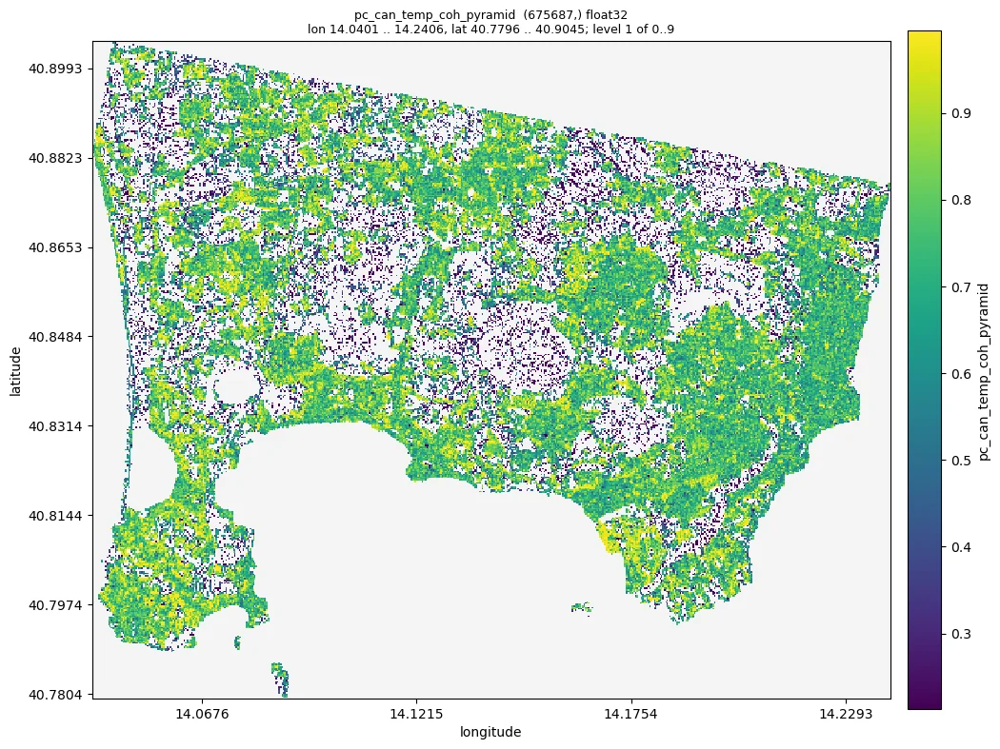
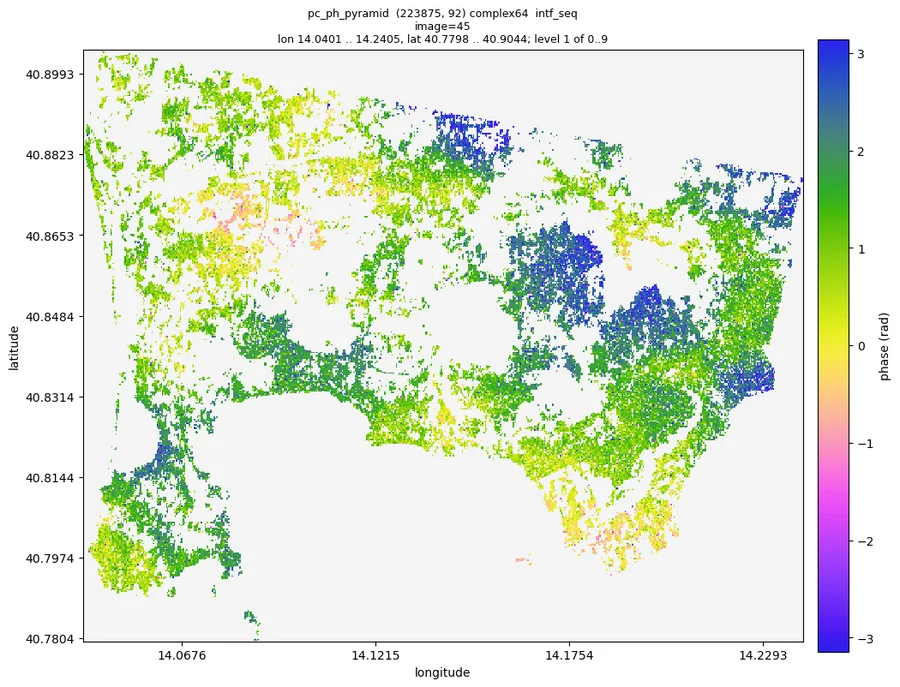

# 04 Merge PS and DS, refine with n2ft

Pipeline: `examples/04_refine.toml`. Tutorial: `nbs/Tutorials/CLI/CampiFlegrei/04_refine.ipynb`.
Needs `02_ps` and `03_ds`.

```bash
moraine run examples/04_refine.toml --workdir WORK
```

## Steps

1. `pc-union` of the DS (their phase history) and the PS candidates (their rslc), with e/n; a point in both
   sets keeps the DS phase history (the first input of `pc-union` wins);
   `ras2pc` adds lon/lat.
2. `image-pairs` (sequential) and `n2ft`: Noise2Fringe Transformer filtering of the point cloud
   interferograms (chunks of 20 000 points with k nearest neighbour halos).
3. `temp-coh` between the filtered and the raw phase; points with temporal coherence > 0.8 are kept
   (`pc-logic-pc`, `pc-select-data`).

Outputs (WORK/pc/): merged candidates `pc_can_*`; refined points `pc_hix.zarr`, `pc_ph.zarr`
(n_points, nimages), their coordinates `pc_e.zarr`, `pc_n.zarr`, `pc_lon.zarr`, `pc_lat.zarr`, their temporal
coherence `pc_temp_coh.zarr`, and the geometry the deformation products need: height `pc_hgt.zarr`, look vector
`pc_theta.zarr`, `pc_phi.zarr` (GAMMA elevation and orientation angles, radians) and slant range `pc_range.zarr`
(m); pyramids `pc_can_temp_coh_pyramid`, `pc_ph_pyramid`.

## Parameters

- Temporal coherence threshold: 0.7-0.85; lower keeps more points with more noise.
- `temp_coh` runs on the CPU (`cuda = false` in the step): it reads the data once and reduces them, starting a
  GPU worker costs more than the GPU saves.
- `n2ft` `chunks`: points per chunk (20 000); smaller uses less GPU memory.
- `n2ft` `compile`: the model is compiled with torch.compile in every worker when points times image pairs is at
  least 1e8 (15-40 s once per worker, less when torch has cached it; the model then runs about 3 times faster on a
  GPU); `compile = true` or `false` forces it. Not worth it for the sample data.

## Expected results (sample data, Campi Flegrei, 981 x 4160 x 92)

| result | sample value | sane range |
|---|---|---|
| merged candidates | 675 687 | about PS + DS minus overlap |
| `pc_can_temp_coh_pyramid` | p50 0.79, p01 0.21, p99 0.995 | 0..1 |
| refined points (`pc_hix`) | 330 754 (49 % of the candidates; 99.9 % of the DS, 32 % of the PS candidates that are not DS) | |

Run time: about 40 s with an A100 (n2ft 28 s for 91 image pairs).

## Figures

Quicklooks of the sample data run of 2026-10-10 (the numbers above are from the same run):



*Temporal coherence of the merged candidates after the Noise2Fringe Transformer (`pc/pc_can_temp_coh_pyramid`).*



*Sequential interferogram 45 (2020-07-07 / 2020-07-19) of the refined points (`pc/pc_ph_pyramid --show intf_seq
--index 45`): continuous phase, no noise.*


*Interferogram 2019-01-02 / 2021-12-29 of the refined points (`--show intf_all --index 0 91`): the concentric fringes
of the caldera uplift centred on Pozzuoli, about ten fringes over three years.*

## Checks

- `moraine quicklook pc/pc_ph_pyramid --show intf_seq --index I -o pc_intf.png`: interferograms of
  the refined points should show smooth, spatially continuous phase (fringes), not noise.
- Compare with the raw interferogram: `moraine quicklook raw/rslc_pyramid --show intf_seq --index I`.

## Problems

- `n2ft` is slow on CPU; use a GPU.
- Too few points: lower the temporal coherence threshold or revisit PS / DS thresholds.
